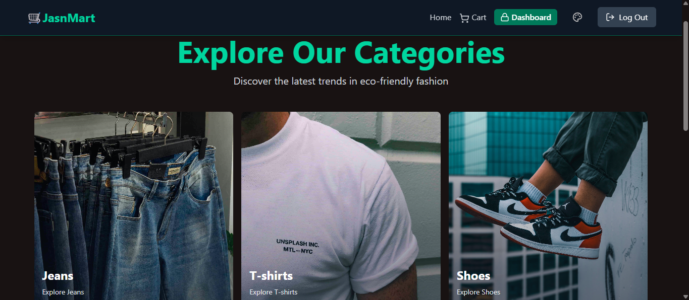
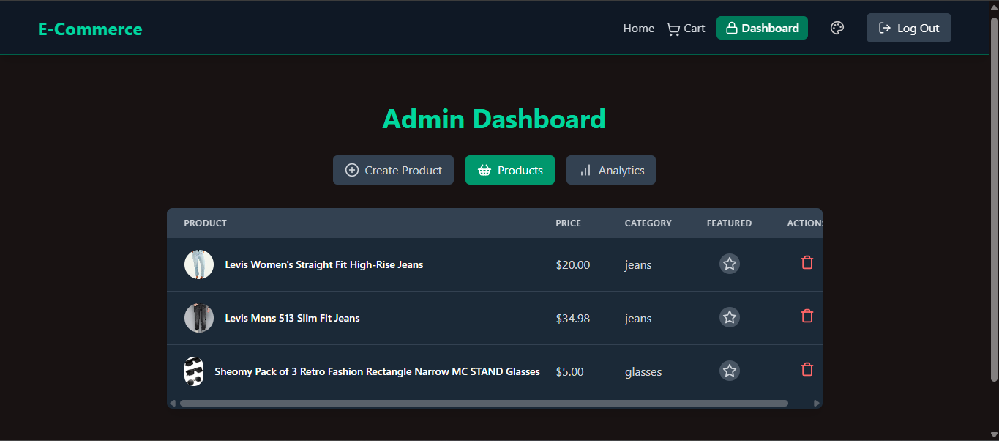
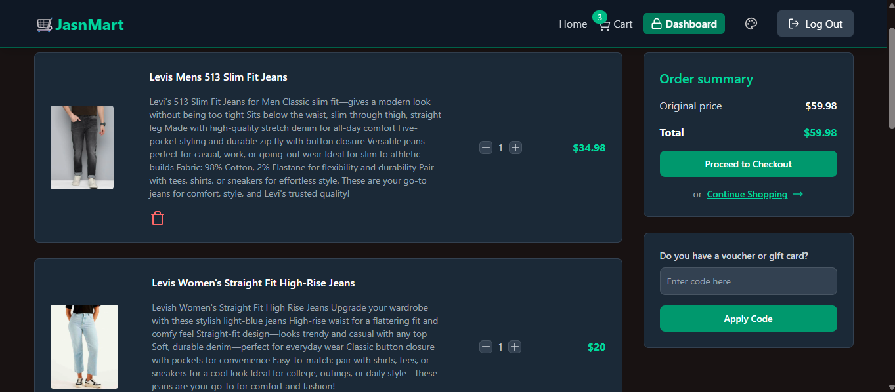
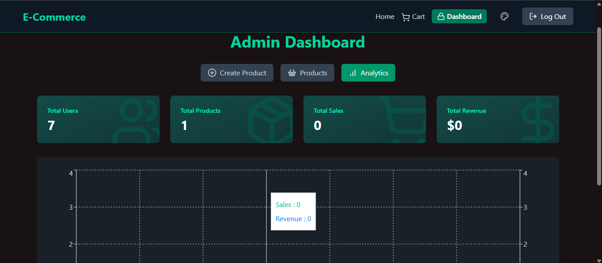
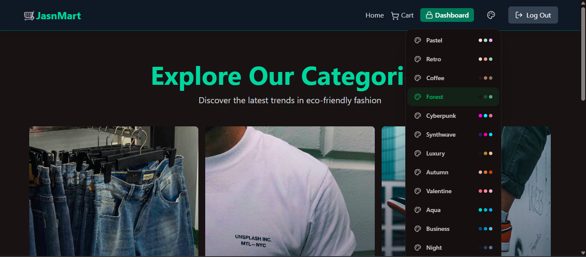
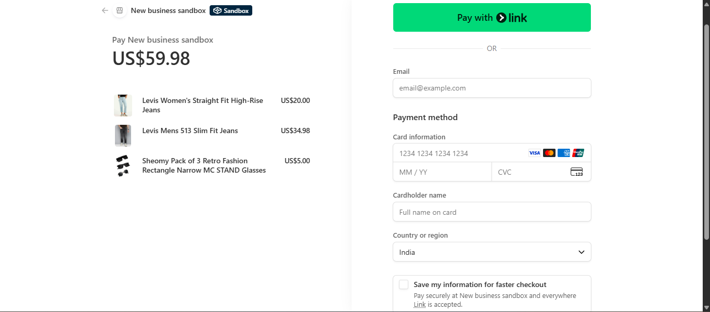

# 🛒 JasnMart - E-Commerce Store


## 📋 Description

JasnMart is a modern, full-stack e-commerce platform built with the latest technologies. This project showcases a complete online shopping experience with user authentication, product management, shopping cart functionality, secure payments via Stripe, coupon system, and an admin dashboard with analytics. The application features a responsive design with multiple themes, making it perfect for eco-friendly fashion stores.

## 🎥 Screenshots

### 🏠 Home Page


### 🛍️ Products Page


### 🛒 Cart Page


### 👑 Admin Dashboard - Create Product


### 📊 Analytics Dashboard


### 🎨 Themes


### 💳 Purchase Success


### ❌ Purchase Cancelled


## ✨ Features

### 🔐 Authentication & Security
- User registration and login
- JWT-based authentication with access and refresh tokens
- Password hashing with bcryptjs
- Protected routes and middleware

### 🛍️ E-Commerce Core
- Product catalog with categories (Jeans, T-shirts, Shoes, Glasses, Jackets, Suits, Bags)
- Shopping cart functionality
- Secure checkout with Stripe integration
- Order management and history

### 🎫 Coupons & Discounts
- Coupon code system
- Percentage-based discounts
- Gift coupon cards

### 👑 Admin Dashboard
- Product creation and management
- Featured product toggling
- Sales analytics with charts
- User and revenue statistics

### 🎨 User Experience
- Multiple theme support (Light/Dark modes)
- Responsive design for all devices
- Smooth animations with Framer Motion
- Real-time cart updates

### 📈 Analytics & Insights
- Daily sales and revenue charts
- User statistics
- Product performance metrics
- Interactive dashboards with Recharts

### ☁️ Cloud Integration
- Image uploads via Cloudinary
- Redis caching for performance
- MongoDB database with Mongoose ODM

## 🛠️ Tech Stack

### Backend
- **Runtime**: Node.js
- **Framework**: Express.js
- **Database**: MongoDB with Mongoose
- **Caching**: Redis
- **Authentication**: JWT (JSON Web Tokens)
- **Payments**: Stripe API
- **File Uploads**: Cloudinary
- **Security**: bcryptjs for password hashing

### Frontend
- **Framework**: React 18 with Vite
- **Styling**: Tailwind CSS + DaisyUI
- **State Management**: Zustand
- **Routing**: React Router DOM
- **HTTP Client**: Axios
- **Icons**: Lucide React
- **Charts**: Recharts
- **Animations**: Framer Motion
- **Forms**: React Hook Form

### DevOps & Tools
- **Version Control**: Git
- **Package Manager**: npm
- **Development**: Concurrently for running multiple scripts
- **Linting**: ESLint
- **Build Tool**: Vite

## 📋 Prerequisites

Before running this application, make sure you have the following installed:

- Node.js (v18 or higher)
- MongoDB (local or cloud instance)
- Redis (local or cloud instance)
- Git

## 🚀 Installation

1. **Clone the repository**
   ```bash
   git clone https://github.com/your-username/jasn-mart.git
   cd jasn-mart
   ```

2. **Install dependencies**
   ```bash
   npm run build
   ```

3. **Set up environment variables**

   Create a `.env` file in the root directory and add the following:

   ```env
   PORT=5000
   MONGO_URI=your_mongo_uri
   UPSTASH_REDIS_URL=your_redis_url
   ACCESS_TOKEN_SECRET=your_access_token_secret
   REFRESH_TOKEN_SECRET=your_refresh_token_secret
   CLOUDINARY_CLOUD_NAME=your_cloud_name
   CLOUDINARY_API_KEY=your_api_key
   CLOUDINARY_API_SECRET=your_api_secret
   STRIPE_SECRET_KEY=your_stripe_secret_key
   CLIENT_URL=http://localhost:5173
   NODE_ENV=development
   ```

4. **Start the development server**
   ```bash
   npm run dev
   ```

   This will start both the backend server (http://localhost:5000) and frontend (http://localhost:5173).

## 🔧 Usage

### For Users
1. Visit the application at `http://localhost:5173`
2. Sign up for a new account or log in
3. Browse products by categories
4. Add items to cart
5. Apply coupon codes for discounts
6. Proceed to checkout with Stripe
7. Complete payment

### For Admins
1. Log in with admin credentials
2. Access the admin dashboard at `/secret-dashboard`
3. Create new products
4. Manage existing products
5. View analytics and sales data

## 📁 Project Structure

```
jasn-mart/
├── backend/
│   ├── controllers/     # Route controllers
│   ├── lib/            # Utility libraries (DB, Redis, Stripe, etc.)
│   ├── middleware/     # Authentication middleware
│   ├── models/         # MongoDB models
│   ├── routes/         # API routes
│   └── server.js       # Main server file
├── frontend/
│   ├── public/         # Static assets
│   ├── src/
│   │   ├── components/ # React components
│   │   ├── pages/      # Page components
│   │   ├── stores/     # Zustand stores
│   │   └── lib/        # Utility functions
│   └── package.json
├── package.json        # Root package.json with workspaces
└── README.md
```

## 🤝 Contributing

Contributions are welcome! Please follow these steps:

1. Fork the repository
2. Create a feature branch (`git checkout -b feature/amazing-feature`)
3. Commit your changes (`git commit -m 'Add some amazing feature'`)
4. Push to the branch (`git push origin feature/amazing-feature`)
5. Open a Pull Request

## 📄 License

This project is licensed under the ISC License - see the [LICENSE](LICENSE) file for details.

## 👨‍💻 Author

**Your Name**
- GitHub: [@your-username](https://github.com/your-username)
- LinkedIn: [Your LinkedIn](https://linkedin.com/in/your-profile)

---

⭐ If you found this project helpful, please give it a star!

---

*Built with ❤️ using modern web technologies*
